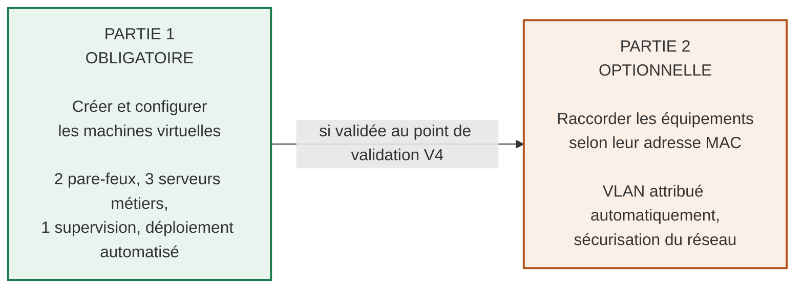
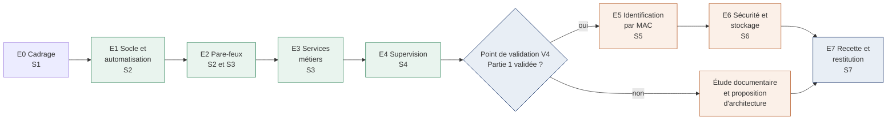
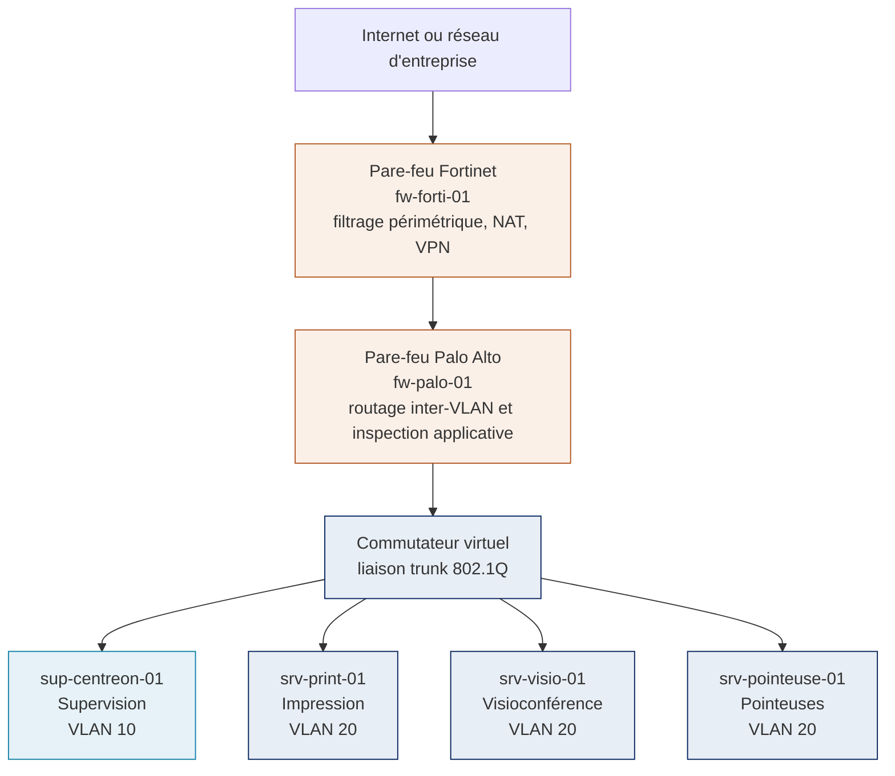
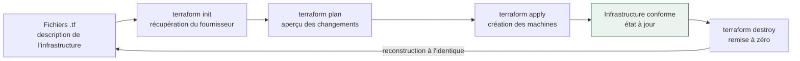
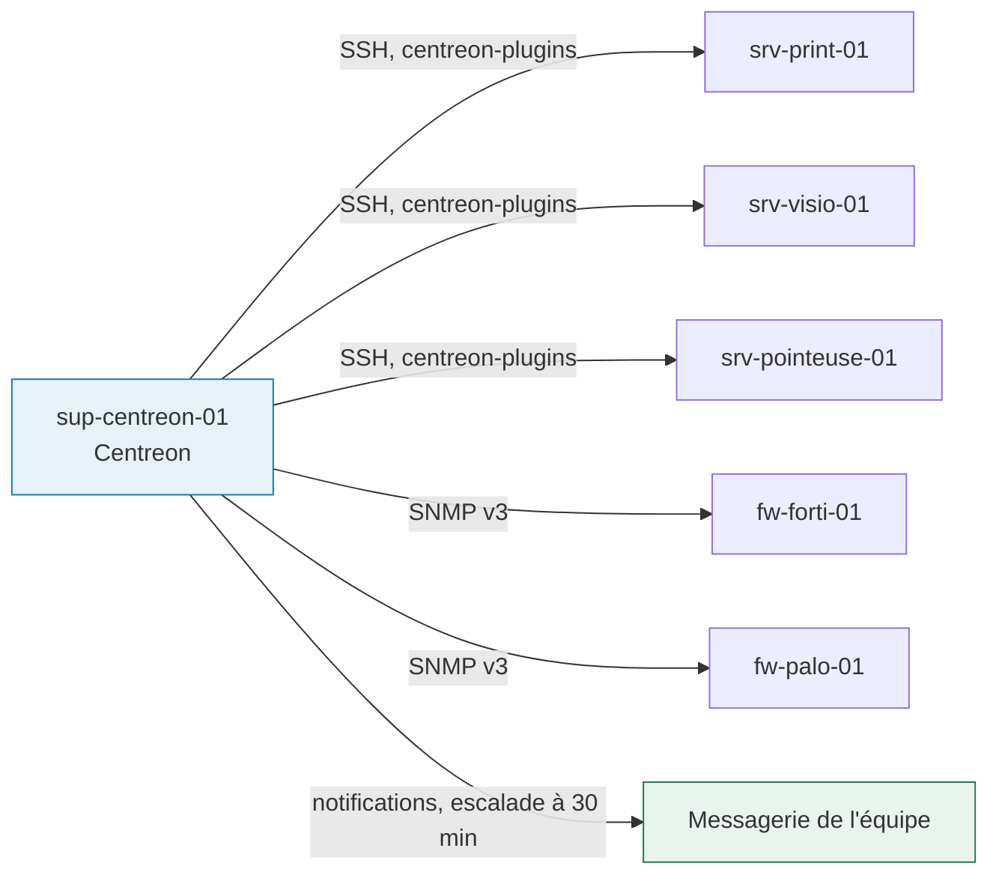
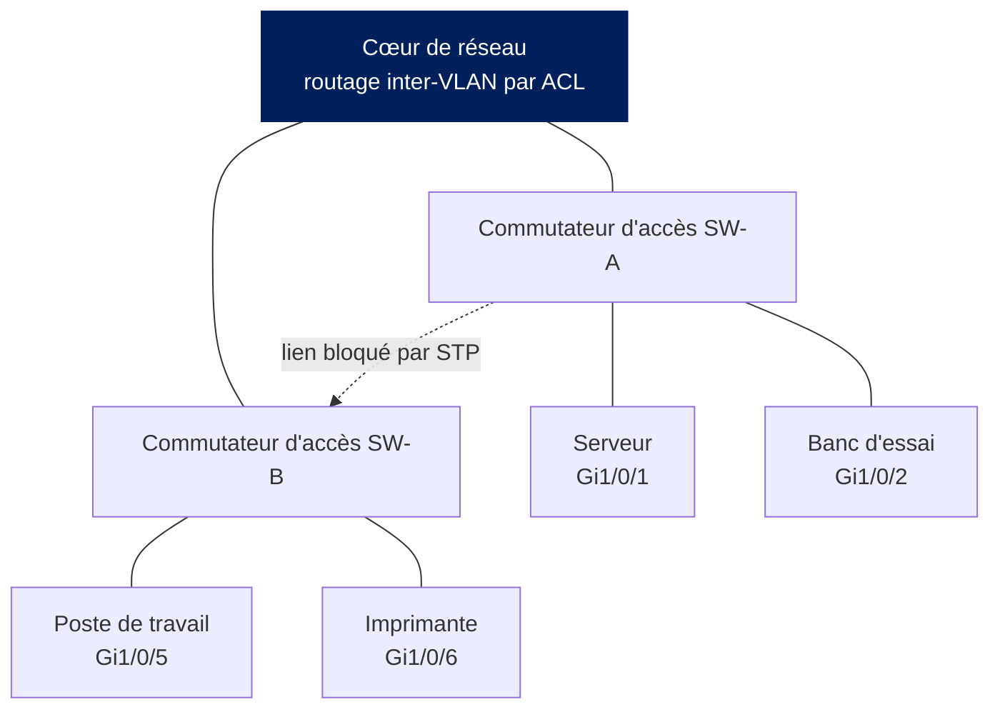
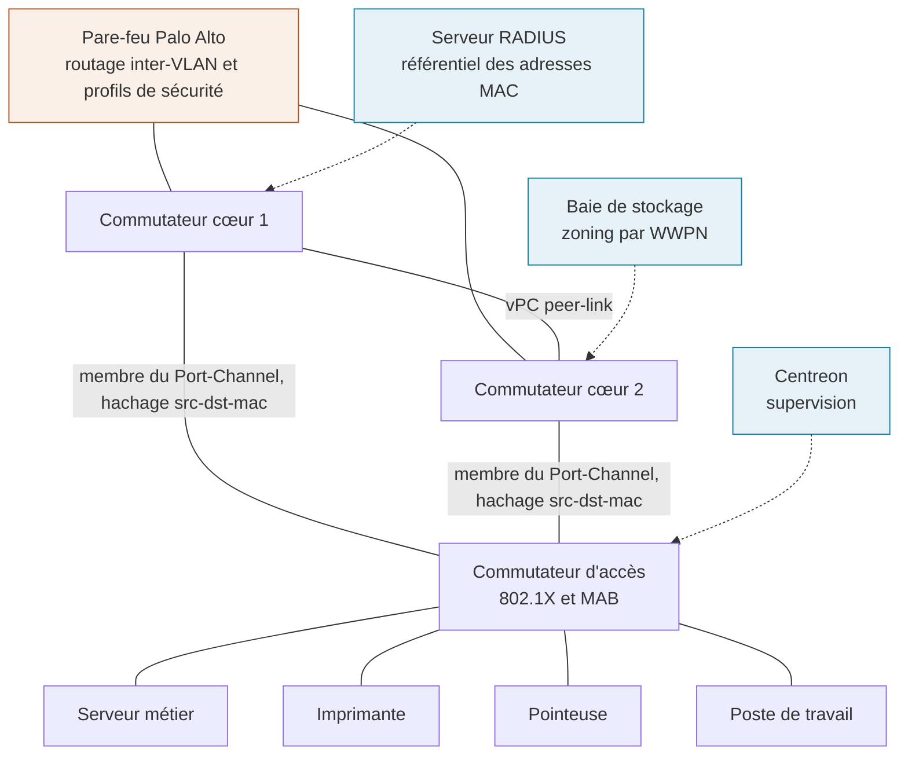
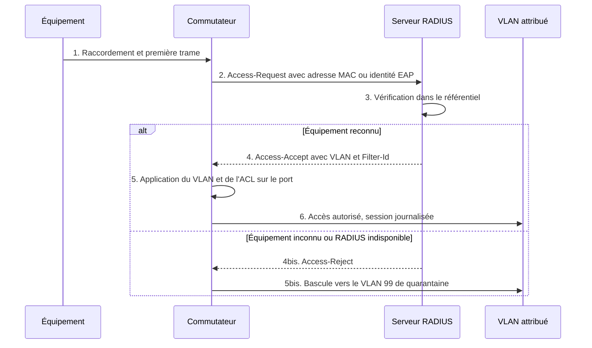

# CAHIER DES CHARGES

## Mise en place d'une infrastructure virtualisée et identification des équipements par adresse MAC

**Airbus, Direction des Systèmes d'Information**
*Service Infrastructure et Sécurité Réseau*
*Stage d'été, 45 jours*

---

### Un projet en deux parties

| Partie | Statut | Contenu |
|---|---|---|
| **Partie 1** | **Obligatoire** | Création et configuration des machines virtuelles : deux pare-feux, trois serveurs métiers et une machine de supervision. |
| **Partie 2** | **Optionnel** | Raccordement des équipements aux commutateurs selon leur adresse MAC, avec affectation automatique du VLAN. |

*La partie 2 n'est engagée que si la partie 1 est terminée et validée. Conditions détaillées à la section 2.3.*

---

| Rubrique | Valeur |
|---|---|
| **Référence** | CDC-RES-INFRA-MAC-2026-001 |
| **Version** | 2.0, pour validation |
| **Classification** | Diffusion interne |
| **Date d'édition** | 7 août 2026 |
| **Durée** | 45 jours, répartis sur 7 semaines |
| **Auteur** | ..................................... |
| **Tuteur entreprise** | ..................................... |
| **Tuteur académique** | ..................................... |
| **Période du stage** | ..................................... |

*Document de travail. Ne pas diffuser à l'extérieur de l'organisation.*

---

# Fiche de suivi du document

## Historique des versions

| Version | Date | Rédacteur | Nature de la modification |
|---|---|---|---|
| 0.5 | .......... | .......... | Trame initiale et étude de l'existant. |
| 1.0 | .......... | .......... | Première version, volet réseau uniquement. |
| 2.0 | 7 août 2026 | .......... | Ajout de la partie infrastructure, de l'automatisation Terraform et de la supervision. Le volet réseau devient une partie optionnelle. Réorganisation complète du document. |

## Validation

| Rôle | Nom ou entité | Date | Visa |
|---|---|---|---|
| Rédacteur | .......... | .......... | .......... |
| Vérificateur | Responsable Infrastructure Réseau | .......... | .......... |
| Approbateur | Responsable Sécurité | .......... | .......... |

> **Comment lire ce document**
>
> Le document est organisé en trois blocs. L'**introduction générale** pose le contexte, les objectifs et le planning. La **partie 1** décrit l'infrastructure à construire : c'est le cœur du stage et elle est obligatoire. La **partie 2** décrit une évolution du réseau qui ne sera engagée que si le calendrier le permet.
>
> Chaque élément porte une référence unique : **INF** pour les exigences d'infrastructure, **OG** et **OBJ** pour les objectifs, **BF** et **BNF** pour les besoins du volet réseau, **C** pour les contraintes, **L** pour les limites de l'existant, **R** pour les risques, **TI** et **TC** pour les cas de test, **LV** pour les livrables. Ces références sont reprises telles quelles lors de la recette.
>
> Convention : **DOIT** désigne une exigence impérative qui conditionne la recette, **DEVRAIT** une exigence recommandée dont tout écart doit être justifié.

---

# Sommaire

**Introduction générale**

1. Présentation du projet
2. Organisation du projet
3. Objectifs
4. Déroulement du projet

**Partie 1 : infrastructure virtualisée (obligatoire)**

5. Exigences de la partie 1
6. Architecture de l'infrastructure
7. Les six machines et leur rôle
8. Choix techniques et environnement de travail
9. Automatisation avec Terraform
10. Supervision avec Centreon
11. Recette de la partie 1

**Partie 2 : identification par adresse MAC (optionnelle)**

12. Objet et objectifs du volet réseau
13. Architecture cible
14. Exigences de la partie 2
15. Sécurité
16. Moyens complémentaires et recette

17. Conclusion

**Annexes**

- Annexe A : configurations de référence
- Annexe B : exemples de code Terraform
- Annexe C : commandes de vérification courantes

*Les définitions et abréviations, classées par domaine, précèdent l'introduction générale.*

---

# Définitions et abréviations

Les termes sont regroupés par domaine, puis classés par ordre alphabétique.

## 1. Réseau et segmentation

| Terme | Définition |
|---|---|
| **802.1Q** | Étiquetage des trames, qui fait circuler plusieurs VLAN sur un même lien. |
| **ACL** | Liste de contrôle d'accès appliquée sur un équipement réseau. |
| **CAM** | Table dans laquelle un commutateur mémorise les adresses MAC vues sur chaque port. |
| **DTP** | Protocole Cisco de négociation automatique du mode trunk entre commutateurs. |
| **LACP** | Protocole qui négocie l'agrégation de plusieurs liens physiques. |
| **Port-Channel** | Groupe de liens physiques agrégés, vu comme un lien logique unique. |
| **SVI** | Interface virtuelle assurant le routage d'un VLAN sur un commutateur. |
| **VLAN** | Réseau local virtuel : segment logique indépendant du câblage. |
| **vPC** | Agrégation de liens répartie sur deux châssis, pour la redondance. |

## 2. Identification et sécurité

| Terme | Définition |
|---|---|
| **802.1X** | Contrôle d'accès au réseau par port, avec authentification de l'équipement. |
| **DAI** | Contrôle de cohérence des messages ARP, qui bloque les réponses falsifiées. |
| **EAP** | Cadre d'authentification transporté par le 802.1X entre l'équipement et le serveur. |
| **IPSG** | Filtrage des adresses IP sources non légitimes sur un port d'accès. |
| **MAB** | Authentification d'un équipement sur la seule base de son adresse MAC. |
| **MAC** | Identifiant physique d'une interface réseau, codé sur 48 bits. |
| **RADIUS** | Service centralisé qui répond aux demandes d'authentification. |

## 3. Systèmes, virtualisation et automatisation

| Terme | Définition |
|---|---|
| **cloud-init** | Configure une machine virtuelle à son premier démarrage. |
| **FortiOS** | Système d'exploitation embarqué des pare-feux Fortinet. |
| **IaC** | *Infrastructure as Code* : description de l'infrastructure dans des fichiers versionnés. |
| **LTS** | Version d'un système bénéficiant d'un support de longue durée. |
| **OpenStack** | Plateforme libre permettant d'héberger un cloud privé. |
| **PAN-OS** | Système d'exploitation embarqué des pare-feux Palo Alto. |
| **Terraform** | Crée une infrastructure à partir d'une description en fichiers texte. |

## 4. Services, supervision et stockage

| Terme | Définition |
|---|---|
| **CUPS** | Service d'impression standard des systèmes Linux. |
| **IPP** | Protocole d'impression réseau, sur le port 631. |
| **Jitsi Meet** | Solution libre de visioconférence, hébergeable entièrement sur site. |
| **LUN** | Volume logique exposé par une baie de stockage. |
| **NTP** | Protocole de synchronisation de l'heure entre machines. |
| **SNMP** | Protocole d'interrogation des équipements, utilisé pour la supervision. |
| **WWPN** | Identifiant unique d'un port Fibre Channel, équivalent d'une adresse MAC. |

---
---

# INTRODUCTION GÉNÉRALE

### Présentation, objectifs et organisation

*Ce qui est demandé, pourquoi, et comment le travail se répartit sur les 45 jours du stage.*

> **Contenu de cette partie**
>
> - **Section 1.** Objet du document, contexte et besoin exprimé.
> - **Section 2.** Les deux parties du projet, leur priorité et le périmètre retenu.
> - **Section 3.** Objectifs et indicateurs de réussite.
> - **Section 4.** Étapes, planning, livrables et risques.

---

# 1. Présentation du projet

## 1.1 Objet du document

Ce document définit le contenu de mon stage : ce qui doit être réalisé, avec quels moyens, et à quelles conditions le travail sera considéré comme terminé. Il sert de référence commune entre mon tuteur entreprise, mon tuteur académique et moi. Une fois validé, il fige le périmètre du stage.

## 1.2 Contexte

Le service Infrastructure et Sécurité Réseau exploite le réseau interne, les pare-feux et les services communs. Deux difficultés reviennent régulièrement.

L'équipe ne dispose pas d'un environnement de test isolé. Les nouvelles configurations sont validées sur des équipements de préproduction partagés, ce qui interdit les essais un peu risqués, en particulier sur les fonctions de sécurité.

Par ailleurs, le VLAN d'un équipement est inscrit en dur dans la configuration du port du commutateur. Déplacer un matériel demande donc une intervention manuelle, soit 30 à 60 minutes d'immobilisation.

## 1.3 Le besoin

Le besoin principal est de disposer d'un laboratoire virtualisé, complet et reproductible, où l'on peut installer, casser et reconstruire une infrastructure sans risque pour la production.

Un second besoin, moins urgent, est d'étudier une architecture où la politique réseau suit l'équipement plutôt que la prise murale. Ce travail se déroule dans le laboratoire, il ne peut donc venir qu'après.

---

# 2. Organisation du projet

## 2.1 Deux parties, deux niveaux de priorité

Le projet comporte deux parties de nature différente. La première est le cœur du stage et doit être livrée. La seconde est une étude complémentaire, lancée seulement si le calendrier le permet.



## 2.2 Partie 1 : mise en place de l'infrastructure

**[Obligatoire]** Monter un laboratoire complet à base de machines virtuelles. Six machines sont à créer, configurer et documenter : deux pare-feux de constructeurs différents, un serveur d'impression, un serveur de visioconférence, un serveur de gestion des pointeuses et une machine de supervision. Le déploiement est automatisé avec Terraform, ce qui permet de reconstruire l'ensemble à l'identique autant de fois que nécessaire.

## 2.3 Partie 2 : identification par adresse MAC

**[Optionnel]** Cette partie s'appuie sur le laboratoire pour tester une autre façon de raccorder les équipements. Aujourd'hui, le VLAN dépend du port sur lequel on branche le matériel. L'idée est de le faire dépendre de l'adresse MAC : le commutateur interroge un serveur d'authentification, qui lui indique le VLAN à appliquer. Le matériel peut alors être déplacé sans aucune reconfiguration.

> **Conditions de lancement de la partie 2**
>
> La partie 2 n'est lancée que si les trois conditions suivantes sont réunies, constatées au point de validation V4 avec le tuteur.
>
> - La partie 1 est terminée et ses six cas de test, TI-01 à TI-06, sont passés avec succès, au plus tard à la fin de la semaine 4.
> - Les images de commutateurs virtuels sont disponibles et fonctionnelles.
> - L'hôte de virtualisation dispose des ressources pour les machines supplémentaires.
>
> Si une condition manque, la partie 2 se limite à une étude documentaire et à une proposition d'architecture. Ce repli n'a aucun effet sur la recette de la partie 1.

## 2.4 Périmètre

| Statut | Éléments |
|---|---|
| **Inclus** *(partie 1)* | Construction du laboratoire virtualisé ; déploiement des deux pare-feux ; installation et configuration des trois services métiers ; supervision centralisée sous Centreon ; automatisation du déploiement avec Terraform ; documentation et recette. |
| **Optionnel** *(partie 2)* | Authentification des équipements par 802.1X et MAB avec affectation dynamique de VLAN ; agrégation de liens et répartition de charge par hachage MAC ; durcissement de la couche 2 ; filtrage inter-VLAN sur pare-feu ; raccordement au stockage par identité. |
| **Exclu** | Déploiement en production ; réseau étendu et réseau sans fil ; refonte du plan d'adressage de production ; achat de matériel ; migration des applications existantes ; reprise des données réelles des services métiers. |

---

# 3. Objectifs

Chaque objectif est associé à un indicateur mesurable, vérifié lors de la recette.

| Réf. | Objectif | Indicateur |
|---|---|---|
| OG-01 | Disposer d'un laboratoire isolé de la production et reconstructible à l'identique. | Infrastructure recréée depuis zéro en moins de 2 heures. |
| OG-02 | Héberger chaque service métier sur une machine dédiée, configurée et documentée. | Les trois services testés depuis un poste client. |
| OG-03 | Superviser toute l'infrastructure depuis un point unique. | 100 % des machines visibles dans la supervision, alerte en moins de 60 s. |
| OG-04 | Automatiser la création des machines virtuelles. | Déploiement lancé par une seule commande. |

Ces quatre objectifs conditionnent la réussite du stage. Ceux de la partie 2, qui ne sont évalués que si celle-ci est lancée, figurent à la section 12.3.

---

# 4. Déroulement du projet

## 4.1 Étapes et points de validation

Le projet est découpé en étapes réalisables et réversibles indépendamment, ce qui permet de livrer quelque chose d'utile même si l'une d'elles prend du retard.

| Étape | Intitulé | Contenu | Semaines | Validation |
|---|---|---|---|---|
| | ***Partie 1, obligatoire*** | | | |
| E0 | Préparation | Étude de l'existant, validation du cahier des charges, choix de la plateforme d'hébergement. | S1 | V1 |
| E1 | Socle et automatisation | Préparation de l'hôte ou du compte cloud, code Terraform, réseaux et VLAN, création des machines. | S2 | V2 |
| E2 | Pare-feux | Fortinet et Palo Alto : zones, règles, routage inter-VLAN, journalisation. | S2 et S3 | |
| E3 | Services métiers | Impression, visioconférence et pointeuses, avec essais depuis un poste client. | S3 | V3 |
| E4 | Supervision | Centreon : hôtes, sondes, seuils, notifications, tableaux de bord. | S4 | V4 |
| | ***Partie 2, optionnelle*** | | | |
| E5 | Identification par MAC | Serveur RADIUS, 802.1X et MAB, VLAN dynamique, agrégation de liens. | S5 | V5 |
| E6 | Sécurité et stockage | Durcissement de la couche 2, profils de sécurité, matrice de flux, zoning par WWPN. | S6 | |
| | ***Clôture*** | | | |
| E7 | Recette et restitution | Exécution des cahiers de recette, rapport de stage, préparation de la soutenance. | S7 | V6 |

Le point de validation **V4**, en fin de semaine 4, commande la suite : la partie 2 y est lancée ou abandonnée.



## 4.2 Planning prévisionnel

| Semaine | Travaux | Statut |
|---|---|---|
| S1 | Étude de l'existant, cahier des charges, choix de la plateforme. | Obligatoire |
| S2 | Code Terraform, réseaux et VLAN, création des machines, mise en service des pare-feux. | Obligatoire |
| S3 | Fin de configuration des pare-feux, installation des trois services métiers. | Obligatoire |
| S4 | Supervision Centreon complète, puis décision sur la suite du projet au point de validation V4. | Obligatoire |
| S5 | Serveur RADIUS, 802.1X et MAB, VLAN dynamique, agrégation de liens. | Optionnel |
| S6 | Durcissement de la couche 2, profils de sécurité, matrice de flux, stockage par WWPN. | Optionnel |
| S7 | Cahiers de recette, rapport de stage, préparation de la soutenance. | Obligatoire |

## 4.3 Livrables

| Réf. | Livrable | Description | Validation |
|---|---|---|---|
| LV-01 | Cahier des charges | Le présent document, validé par les tuteurs. | V1 |
| LV-02 | Code Terraform | Fichiers d'infrastructure versionnés et commentés, avec leur procédure d'usage. | V2 |
| LV-03 | Dossier d'architecture | Schémas, plan VLAN, plan d'adressage. | V3 |
| LV-04 | Dossier de supervision | Hôtes et sondes, seuils, traitement des alertes. | V4 |
| LV-05 | Configurations de référence | Configurations des pare-feux et des serveurs, versionnées et restaurables. | V4 |
| LV-06 | Dossier du volet réseau *(optionnel)* | Architecture cible, configurations des commutateurs, mesures de charge. | V5 |
| LV-07 | PV de recette et rapport de stage | Résultats des cas de test, procédures d'exploitation, support de soutenance. | V6 |

## 4.4 Risques

| Risque | Conséquence | Mesure de réduction |
|---|---|---|
| Ressources insuffisantes sur le poste de travail | Impossibilité de démarrer toutes les machines | Démarrage par groupes, ou bascule vers le cloud |
| Images ou licences d'évaluation indisponibles | Retard sur l'étape des pare-feux | Demande dès la première semaine, solutions libres identifiées en remplacement |
| Processeur Apple Silicon incompatible avec les images x86_64 | Blocage du scénario local | Décision en S1, scénario cloud prêt en repli |
| Retard sur la partie 1 | Partie 2 non réalisable | Partie 2 déjà déclarée optionnelle, repli sur une étude documentaire |
| Fonctions non prises en charge par les commutateurs virtuels | Partie 2 non validable | Vérification au point de validation V4 avant engagement |

---
---

# PARTIE 1 : MISE EN PLACE DE L'INFRASTRUCTURE VIRTUALISÉE

### Statut : OBLIGATOIRE

*Volet principal du stage : créer et configurer les six machines virtuelles du laboratoire.*

> **Contenu de cette partie**
>
> - **Section 5.** Exigences à respecter.
> - **Section 6.** Architecture, plan VLAN et adressage.
> - **Section 7.** Les six machines et leur rôle.
> - **Section 8.** Choix techniques et poste de travail.
> - **Section 9.** Automatisation avec Terraform.
> - **Section 10.** Supervision avec Centreon.
> - **Section 11.** Recette de la partie 1.

---

# 5. Exigences de la partie 1

| Réf. | Exigence | Niveau |
|---|---|---|
| INF-01 | Deux pare-feux virtuels, un Fortinet et un Palo Alto, **DOIVENT** être déployés et intégrés à l'architecture. | Obligatoire |
| INF-02 | Chaque service métier **DOIT** disposer de sa propre machine, sans mutualisation. | Obligatoire |
| INF-03 | Les serveurs **DOIVENT** être installés sous Ubuntu Server 22.04 LTS. Les pare-feux font exception et gardent le système de leur constructeur. | Obligatoire |
| INF-04 | Une machine de supervision sous Centreon **DOIT** surveiller toutes les autres. | Obligatoire |
| INF-05 | Le plan d'adressage et le découpage VLAN **DOIVENT** être validés avant tout déploiement. | Obligatoire |
| INF-06 | Chaque serveur **DOIT** être durci : compte nominatif, accès SSH par clé, pare-feu local actif, mises à jour de sécurité automatiques. | Obligatoire |
| INF-07 | La création des machines virtuelles **DOIT** être automatisée avec Terraform. | Obligatoire |
| INF-08 | Les configurations et le code d'infrastructure **DOIVENT** être versionnés dans un dépôt Git. | Obligatoire |
| INF-09 | La configuration d'un serveur **DEVRAIT** être sauvegardée avant toute modification importante. | Recommandé |
| INF-10 | L'heure **DOIT** être synchronisée par NTP sur toutes les machines, pare-feux compris. | Obligatoire |

> **Précision sur le système d'exploitation**
>
> Les serveurs métiers et la machine de supervision fonctionnent sous Ubuntu Server 22.04 LTS, dont le support court jusqu'en avril 2027. Les deux pare-feux font exception : FortiGate et Palo Alto sont livrés sous forme d'images virtuelles embarquant leur propre système, FortiOS et PAN-OS. Il n'est ni possible ni souhaitable de les installer sur Ubuntu.

---

# 6. Architecture de l'infrastructure

## 6.1 Principe retenu

Le filtrage se fait en cascade. Le pare-feu Fortinet occupe la position périmétrique : point d'entrée depuis le réseau d'entreprise, il assure la traduction d'adresses et bloque ce qui n'a rien à faire dans le laboratoire. Le Palo Alto est placé derrière lui et assure le routage entre VLAN ainsi que l'inspection applicative des flux.

Utiliser deux constructeurs différents répond à deux intentions : un incident sur une famille de produits ne compromet pas toute la chaîne de filtrage, et cela permet de comparer les deux solutions les plus répandues du marché.

## 6.2 Schéma de l'architecture



Toutes les machines sont supervisées depuis le VLAN 10 d'administration.

## 6.3 Plan VLAN et adressage

Ce plan est défini dès la partie 1 et reste valable pour la partie 2, ce qui évite toute reprise d'adressage.

| VLAN | Nom | Sous-réseau | Passerelle | Usage |
|---|---|---|---|---|
| 10 | MGMT | 10.10.10.0/24 | 10.10.10.1 | Administration et supervision |
| 20 | SERVERS | 10.10.20.0/24 | 10.10.20.1 | Serveurs métiers |
| 30 | EQUIP | 10.10.30.0/24 | 10.10.30.1 | Imprimantes, pointeuses, bancs d'essais |
| 40 | STORAGE | 10.10.40.0/24 | 10.10.40.1 | Flux de stockage IP |
| 50 | USERS | 10.10.50.0/24 | 10.10.50.1 | Postes de travail |
| 99 | QUARANTINE | 10.10.99.0/24 | 10.10.99.1 | Équipements non authentifiés |
| 999 | NATIVE-UNUSED | sans adressage | sans passerelle | VLAN natif des trunks, inutilisé |

| Machine | VLAN | Adresse | Remarque |
|---|---|---|---|
| `fw-forti-01` | trunk | 10.10.10.254 | Interface d'administration |
| `fw-palo-01` | trunk | 10.10.10.253 | Une sous-interface de niveau 3 par VLAN |
| `sup-centreon-01` | 10 | 10.10.10.30 | Supervision |
| `srv-print-01` | 20 | 10.10.20.11 | Impression |
| `srv-visio-01` | 20 | 10.10.20.12 | Visioconférence |
| `srv-pointeuse-01` | 20 | 10.10.20.13 | Gestion des pointeuses |
| `rad-01` | 10 | 10.10.10.20 | Serveur RADIUS, partie 2 |
| `stor-01` | 40 | 10.10.40.10 | Stockage, partie 2 |
| `clt-01` | 50 | attribution DHCP | Poste client de test |

Les imprimantes et les pointeuses reçoivent leur adresse par DHCP dans le VLAN 30. Ce détail compte pour la partie 2 : ces équipements n'ont pas de client 802.1X et devront donc être identifiés par leur adresse MAC.

---

# 7. Les six machines et leur rôle

## 7.1 Inventaire

| Réf. | Nom | Rôle | Système | vCPU | RAM | Disque |
|---|---|---|---|---|---|---|
| VM-01 | `fw-forti-01` | Pare-feu périmétrique | FortiOS | 1 | 2 Go | 40 Go |
| VM-02 | `fw-palo-01` | Pare-feu interne, routage inter-VLAN | PAN-OS | 2 | 8 Go | 60 Go |
| VM-03 | `srv-print-01` | Serveur d'impression | Ubuntu 22.04 | 1 | 2 Go | 25 Go |
| VM-04 | `srv-visio-01` | Serveur de visioconférence | Ubuntu 22.04 | 2 | 4 Go | 25 Go |
| VM-05 | `srv-pointeuse-01` | Gestion des pointeuses | Ubuntu 22.04 | 1 | 2 Go | 30 Go |
| VM-06 | `sup-centreon-01` | Supervision Centreon | Ubuntu 22.04 | 4 | 8 Go | 60 Go |
| | | **Total** | | **11** | **26 Go** | **240 Go** |

Chaque machine est dimensionnée au plus juste, à partir des prérequis publiés par l'éditeur du composant qu'elle héberge, avec une marge uniquement là où la charge est réelle. Les disques sont alloués à la demande, en *thin provisioning* : les 240 Go annoncés représentent moins de 80 Go réellement occupés au démarrage.

> **Comment ces valeurs ont été fixées**
>
> Trois contraintes d'éditeur commandent le tableau. La licence d'évaluation permanente de FortiGate-VM est plafonnée à **1 vCPU et 2 Go** : au-delà, les ressources sont allouées mais jamais utilisées. Palo Alto documente que les vCPU excédentaires par rapport au modèle licencié **ne sont pas exploités**, et impose un disque de 60 Go ; le modèle VM-100 réclame 6,5 Go de mémoire, d'où les 8 Go retenus. Centreon publie 4 vCPU et 8 Go pour un serveur central autonome, valeur conservée telle quelle.
>
> Pour les trois serveurs Ubuntu, le système consomme environ 300 Mo au repos. CUPS et PostgreSQL tiennent largement dans 2 Go, tandis que Jitsi Videobridge, seul composant réellement sollicité, obtient 2 vCPU dédiés et 4 Go, ce qui correspond au palier « petites réunions » de l'éditeur.

> **Deux garde-fous contre les plantages**
>
> Un fichier d'échange de 2 Go est créé sur chaque serveur Ubuntu, avec `vm.swappiness=10`. Il ne sert jamais en fonctionnement normal mais évite qu'un pic ponctuel n'oblige le noyau à arrêter brutalement un processus.
>
> Sur les pare-feux, la réservation mémoire est fixe et le *ballooning* de l'hyperviseur désactivé. FortiOS passe en mode conservation dès 88 % de mémoire occupée et cesse alors d'inspecter normalement les nouvelles sessions : sur une machine à 2 Go, l'inspection doit rester en mode *flow-based*. C'est la seule limite réelle de ce dimensionnement, et elle est sans effet ici puisque l'inspection applicative est portée par le Palo Alto.

## 7.2 Les deux pare-feux

Le **FortiGate** filtre les échanges entre le laboratoire et l'extérieur : interfaces et zones, règles en refus par défaut, traduction d'adresses, accès VPN SSL pour l'administration à distance et envoi des journaux vers le collecteur syslog.

Le **Palo Alto** porte une sous-interface de niveau 3 par VLAN, ce qui en fait le point de routage du laboratoire. Chaque VLAN devient une zone de sécurité et aucun flux ne passe d'une zone à l'autre sans être soumis à la politique de sécurité. Les profils activés couvrent l'antivirus, l'anti-spyware, la protection contre les vulnérabilités et le filtrage d'URL.

## 7.3 Les trois services métiers

| Service | Logiciel | Ports à ouvrir | Point d'attention |
|---|---|---|---|
| Impression | CUPS | IPP 631 | Une file par imprimante, quotas par utilisateur, accès limité au VLAN des postes. |
| Visioconférence | Jitsi Meet *(Prosody, Jicofo, Videobridge)* | 443 en TCP, 10000 en UDP | Certificat TLS obligatoire, sans quoi le navigateur refuse l'accès à la caméra. |
| Pointeuses | Collecteur et base PostgreSQL | 5432 en local, port constructeur vers les pointeuses | Heure synchronisée par NTP, sauvegarde quotidienne de la base. |

Le **serveur d'impression** centralise les files d'attente et publie les imprimantes en IPP. Les imprimantes restent dans le VLAN 30 et ne dialoguent qu'avec ce serveur.

Le **serveur de visioconférence** s'appuie sur Jitsi Meet, une solution libre qui s'installe entièrement sur site et ne dépend d'aucun service extérieur, ce qui répond à la contrainte de confidentialité. Les salles sont protégées par mot de passe et l'enregistrement n'est pas activé.

Le **serveur de gestion des pointeuses** collecte les passages de badge, les stocke dans une base PostgreSQL et produit des exports pour la gestion des temps. Deux points sont sensibles : un décalage d'horloge fausse directement les pointages, et une interruption prolongée de la collecte entraîne une perte de données difficile à reconstituer. Les deux font l'objet d'une alerte dédiée dans Centreon.

## 7.4 La machine de supervision

La machine `sup-centreon-01` héberge Centreon et surveille toutes les autres. Son rôle est détaillé à la section 10. Un point est à surveiller : Centreon ne prend officiellement en charge que Debian et les distributions de la famille RHEL. L'installation sur Ubuntu 22.04 reste réalisable, les deux systèmes partageant la même base, mais si une difficulté bloquante apparaît, je proposerai à mon tuteur de basculer cette seule machine sous Debian 12.

---

# 8. Choix techniques et environnement de travail

## 8.1 Solutions retenues

| Composant | Solution | Justification |
|---|---|---|
| Système des serveurs | Ubuntu Server 22.04 LTS | Support jusqu'en 2027, documentation abondante, image facile à durcir et à dupliquer. |
| Pare-feux | Fortinet FortiGate VM et Palo Alto VM-Series | Deux solutions de référence, licences d'évaluation disponibles, identification applicative des flux côté Palo Alto. |
| Services métiers | CUPS, Jitsi Meet, PostgreSQL | Solutions libres, hébergeables sur site, standards dans leur domaine. |
| Supervision | Centreon | Déjà exploitée par le service, connecteurs SNMP matures. |
| Automatisation | Terraform | Description déclarative réutilisable sur le cloud comme sur OpenStack. |
| Versionnement | Git | Historique des configurations et retour arrière possible. |

## 8.2 Poste de développement

Le poste utilisé est un MacBook sous macOS. Il sert de station d'administration et, selon le scénario retenu, d'hôte de virtualisation. L'outillage se compose de Homebrew, Terraform, Git, du client OpenStack ou AWS CLI selon la cible, de Visual Studio Code pour le code d'infrastructure, et de VMware Fusion ou UTM pour l'exécution locale des machines.

## 8.3 Contraintes matérielles et solution de repli

Deux limites conditionnent le choix entre déploiement local et déploiement cloud.

La première tient aux ressources. Après optimisation, les six machines cumulent 26 Go de mémoire. Sur un hôte de 32 Go, quatre machines peuvent tourner ensemble sans difficulté, ce qui couvre tous les essais de la partie 1 : les deux pare-feux, un serveur métier et la supervision représentent 20 Go. Le laboratoire complet reste démarrable, mais il est plus confortable de laisser au repos les serveurs métiers que l'on ne teste pas sur le moment.

> **Point de vigilance : architecture du processeur**
>
> Les images FortiOS et PAN-OS n'existent qu'en x86_64. Si le MacBook est équipé d'une puce Apple Silicon, elles ne peuvent pas s'exécuter localement à une vitesse utilisable. Le déploiement sur AWS, Azure ou sur un serveur x86 mutualisé devient alors la solution de repli. Ce point sera tranché avec mon tuteur dès la première semaine, car il détermine le scénario d'automatisation.

---

# 9. Automatisation avec Terraform

## 9.1 Principe et bénéfices

Créer six machines à la main prend du temps et donne rarement deux fois le même résultat : une option oubliée, une taille de disque différente, une interface mal rattachée, et le laboratoire ne se comporte plus comme prévu. L'approche Infrastructure as Code (IaC) consiste à décrire l'infrastructure dans des fichiers texte, puis à laisser l'outil créer exactement ce qui est décrit.

Le bénéfice tient en quatre points : la même description produit toujours la même infrastructure, le déploiement complet se lance en une seule commande, une modification se fait dans le fichier plutôt que machine par machine, et le code versionné dans Git garde la trace de chaque changement.

## 9.2 Deux scénarios possibles

Le choix de la plateforme dépend des moyens mis à disposition. Les deux scénarios utilisent Terraform et seul le fournisseur change, ce qui limite le travail de reprise en cas de bascule.

| | **A. Cloud public, AWS ou Azure** | **B. Local, OpenStack** |
|---|---|---|
| Fournisseur Terraform | `hashicorp/aws`, `hashicorp/azurerm` | `terraform-provider-openstack/openstack` |
| Ressources créées | Réseau virtuel, sous-réseaux, groupes de sécurité, instances | Réseaux Neutron, sous-réseaux, groupes de sécurité, instances |
| Prérequis | Compte ouvert et financé, utilisateur technique avec droits de création | Projet OpenStack et identifiants, images importées dans Glance |
| Avantage | Supprime la contrainte matérielle du poste de travail | Aucun coût récurrent, aucune donnée qui sort de l'entreprise |
| Point d'attention | Images de pare-feux facturées à l'heure, budget à valider au préalable | Dépend de la disponibilité d'une plateforme OpenStack interne |

Deux règles s'appliquent dans les deux cas. Le fichier d'état de Terraform contient des informations sensibles : il est stocké dans un espace distant chiffré, jamais dans le dépôt Git. Les clés d'accès ne figurent pas dans le code et sont fournies par variables d'environnement. Le scénario A est retenu si le MacBook ne peut pas héberger les images x86_64.

## 9.3 Maîtrise du coût dans le scénario cloud

Le dimensionnement de la section 7.1 se traduit directement en types d'instance, et donc en facture.

| Machine | AWS | Azure | Remarque |
|---|---|---|---|
| Serveurs métiers, RADIUS, client | `t3.small` | `B1ms` | Le palier le plus économique compatible avec 2 Go. |
| `srv-visio-01` | `t3.medium` | `B2s` | Deux vCPU non partagés pour le videobridge. |
| `fw-forti-01` | `t3.medium` | `B2s` | Le plus petit gabarit acceptant l'image constructeur. |
| `fw-palo-01` | `m5.large` | `D2s_v3` | Plancher imposé par PAN-OS. |
| `sup-centreon-01` | `t3.large` | `B2ms` | Dimensionnement officiel Centreon. |

Quatre leviers réduisent la facture sans rien changer au projet. Les instances sont **arrêtées en dehors des heures de travail** : un laboratoire utilisé huit heures par jour, cinq jours par semaine, ne tourne qu'un quart du mois, et le calcul ne porte alors que sur les volumes. Les images de pare-feux sont déployées en **BYOL** avec les licences d'évaluation plutôt qu'à l'heure depuis la place de marché, ce qui supprime le surcoût de licence, de loin le premier poste de dépense. Les volumes sont en **gp3**, moins cher que gp2 à performance égale. Enfin, aucune **adresse IP publique** n'est attribuée en dehors du pare-feu périmétrique, l'accès aux autres machines passant par lui.

> **Point de vigilance : limites de la licence d'évaluation FortiGate**
>
> La licence d'évaluation permanente est gratuite et sans expiration, mais elle plafonne la machine à trois interfaces, trois règles de filtrage et trois routes, et ne donne accès à aucune mise à jour de signatures. C'est suffisant pour le rôle périmétrique décrit ici, qui n'utilise qu'une interface externe, une interface interne et l'administration. En revanche, toute extension de ce rôle imposera une licence payante. L'inspection applicative reste portée par le Palo Alto, qui n'est pas concerné par cette limite.

## 9.4 Organisation du code et cycle de travail

Le code est découpé en modules (`reseau`, `serveur`, `parefeu`), et le fichier `inventaire.tf` rassemble le plan VLAN, l'adressage et les machines. Ajouter un serveur revient à ajouter une entrée dans ce seul fichier, sans toucher aux modules. La configuration interne des serveurs, c'est-à-dire les paquets, les utilisateurs et les clés SSH, est réalisée par cloud-init au premier démarrage.

```
infrastructure/
├── providers.tf         # fournisseur et version
├── variables.tf         # paramètres du déploiement
├── inventaire.tf        # plan VLAN, adressage et machines
├── main.tf              # assemblage des modules
├── outputs.tf           # adresses et vérification du dimensionnement
├── terraform.tfvars     # valeurs locales, non versionné
└── modules/
    ├── reseau/          # un réseau virtuel par VLAN
    ├── serveur/         # machine Ubuntu avec cloud-init
    └── parefeu/         # machine à image constructeur
```



L'étape `plan` précède systématiquement l'`apply` : elle affiche ce qui va être créé, modifié ou détruit, et c'est le dernier moment où une erreur peut être corrigée sans conséquence.

Terraform crée et détruit des ressources, mais ne configure pas les services applicatifs : l'installation de CUPS, de Jitsi ou de Centreon reste réalisée par cloud-init et par des scripts documentés. Cette frontière est assumée, l'objectif étant d'automatiser le socle et non de tout industrialiser en 45 jours. Deux exemples de code figurent en annexe B.

---

# 10. Supervision avec Centreon

## 10.1 Rôle et modes de collecte

Centreon doit permettre de savoir à tout moment si une machine répond, si ses ressources sont suffisantes et si ses services fonctionnent, puis de prévenir sans délai en cas d'anomalie. C'est aussi l'outil qui produit les statistiques et les tableaux de bord présentés en soutenance.

Trois méthodes de collecte sont utilisées. Les serveurs Ubuntu sont interrogés par les sondes centreon-plugins exécutées à distance par SSH, ce qui évite d'installer un agent. Les pare-feux remontent leurs informations en SNMP version 3, avec authentification et chiffrement. Certains contrôles applicatifs se font enfin par simple connexion au port du service.



## 10.2 Points de contrôle et alertes

| Cible | Indicateurs | Seuil d'alerte |
|---|---|---|
| Toutes les machines | Disponibilité, processeur, mémoire, espace disque, durée de fonctionnement | Avertissement à 80 %, critique à 90 % |
| `srv-print-01` | Service CUPS, port 631, travaux en attente | Service arrêté ou file bloquée depuis plus de 10 min |
| `srv-visio-01` | Prosody, Jicofo, Videobridge, port 443, conférences actives | Un composant arrêté est critique |
| `srv-pointeuse-01` | Base PostgreSQL, dernier pointage collecté, dérive NTP | Aucune collecte depuis 15 min, dérive supérieure à 2 s |
| Pare-feux | Interfaces, sessions, processeur, tunnels VPN, débit | Interface tombée ou charge supérieure à 85 % |
| `sup-centreon-01` | Auto-supervision du moteur, de la base et du disque | Moteur arrêté |

Les notifications partent par courriel vers l'équipe, avec une escalade si l'incident n'est pas acquitté au bout de 30 minutes. Les maintenances planifiées sont déclarées à l'avance pour éviter les alertes inutiles. Toute anomalie doit être détectée et notifiée en moins de 60 secondes, conformément à OG-03. Trois vues sont préparées : une vue d'ensemble utilisable comme écran mural, une vue par service métier et une vue réseau reprenant l'état des pare-feux.

---

# 11. Recette de la partie 1

La partie 1 est terminée lorsque les six cas ci-dessous sont passés avec succès et consignés dans le procès-verbal de recette.

| Réf. | Objet du test | Critère d'acceptation |
|---|---|---|
| TI-01 | Déploiement automatisé | Toutes les machines créées par une seule commande, conformes au plan d'adressage. |
| TI-02 | Destruction puis reconstruction | Infrastructure identique à l'originale, remise en service en moins de 2 heures. |
| TI-03 | Filtrage par les deux pare-feux | Les flux autorisés passent, les autres sont bloqués et journalisés sur les deux équipements. |
| TI-04 | Fonctionnement des services métiers | Impression d'un document de test, conférence à deux participants, collecte d'un pointage. |
| TI-05 | Remontée dans la supervision | 100 % des machines visibles dans Centreon, sondes en état correct. |
| TI-06 | Détection d'une panne | Arrêt volontaire d'un service, alerte reçue en moins de 60 secondes. |

---
---

# PARTIE 2 : IDENTIFICATION DES ÉQUIPEMENTS PAR ADRESSE MAC

### Statut : OPTIONNELLE

*Volet complémentaire, engagé uniquement si la partie 1 est terminée et validée au point de validation V4.*

> **Contenu de cette partie**
>
> - **Section 12.** Objet, limites de l'existant et objectifs.
> - **Section 13.** Architecture cible et principe d'identification par MAC.
> - **Section 14.** Exigences du volet réseau.
> - **Section 15.** Sécurité et matrice de flux.
> - **Section 16.** Moyens complémentaires et recette.
>
> *Si la partie 2 n'est pas engagée, ce volet reste une étude documentaire et la recette du stage porte uniquement sur la partie 1.*

---

# 12. Objet et objectifs du volet réseau

## 12.1 Ce que traite cette partie

Aujourd'hui, brancher un équipement sur un port du commutateur suffit à lui ouvrir le VLAN configuré sur ce port. Le VLAN dépend donc de l'emplacement, pas de l'équipement. Déplacer une imprimante d'un bureau à un autre oblige à reconfigurer le commutateur.

Cette partie inverse la logique. Le commutateur lit l'adresse MAC de l'équipement qui se raccorde, la soumet à un serveur d'authentification, puis applique le VLAN que celui-ci lui indique. Le port devient indifférent et le déplacement ne demande plus aucune intervention.

## 12.2 Limites de la situation actuelle



Un port physique correspond à un VLAN, qui correspond lui-même à un équipement identifié. Dès que l'équipement change de place, la configuration doit suivre. S'y ajoute une seconde faiblesse visible sur le schéma : le lien entre les deux commutateurs d'accès est bloqué par le spanning-tree, et la bande passante qu'il représente reste inutilisée.

| Réf. | Limite | Impact | Criticité |
|---|---|---|---|
| L-01 | Le port physique détermine l'identité de l'équipement | Toute mobilité impose une reconfiguration manuelle, soit 30 à 60 minutes d'immobilisation. | Élevée |
| L-02 | Aucune authentification de l'équipement | Un port actif donne accès au VLAN sans vérifier ce qui s'y raccorde. | Critique |
| L-03 | Risque d'erreur humaine | Une erreur de VLAN ou d'ACL entraîne une indisponibilité ou une exposition. | Élevée |
| L-04 | Liens redondants bloqués par le spanning-tree | La bande passante disponible n'est pas exploitée. | Moyenne |
| L-05 | Filtrage inter-VLAN limité aux ACL | Ni l'application ni le contenu des flux ne sont inspectés. | Élevée |

## 12.3 Objectifs

| Réf. | Objectif | Indicateur ou cible |
|---|---|---|
| OBJ-01 | Rendre l'identité de l'équipement indépendante de son emplacement. | Aucune action manuelle lors d'un déplacement. |
| OBJ-02 | Réduire le délai de remise en service après un déplacement. | 30 s au maximum, contre 30 à 60 min aujourd'hui. |
| OBJ-03 | Authentifier tout équipement avant de lui ouvrir un accès. | 100 % des ports d'accès sous contrôle. |
| OBJ-04 | Exploiter l'intégralité des liens redondants. | Écart de charge entre liens inférieur ou égal à 20 %. |
| OBJ-05 | Inspecter et superviser les flux inter-VLAN. | 100 % des flux inspectés, détection en 60 s au maximum. |

---

# 13. Architecture cible

## 13.1 Principes et vue d'ensemble

Quatre principes guident la conception. L'identité prime sur l'emplacement : la politique réseau est attachée à l'équipement et non au port. La défense se fait en profondeur : l'identification par adresse MAC n'est qu'un mécanisme d'attribution, complété par des contrôles indépendants. Le point de contrôle est unique : aucun trafic entre VLAN n'échappe à l'inspection. Enfin, chaque décision est journalisée et chaque étape reste retirable séparément.



Le pare-feu assure le routage inter-VLAN, les deux commutateurs cœur apportent la redondance vPC et le commutateur d'accès porte l'authentification des équipements qui s'y raccordent.

## 13.2 Identification par adresse MAC

L'attribution dynamique du VLAN repose sur le couple **802.1X** et **MAB**, associé à un serveur **RADIUS**. Le commutateur joue le rôle d'authentificateur : tant qu'aucune authentification n'a abouti, le port ne laisse passer que le trafic d'authentification.

Le 802.1X est privilégié pour les équipements qui disposent d'un client, postes et serveurs, car l'identité y est portée par un certificat. Le MAB prend le relais pour les matériels qui n'en ont pas, comme les imprimantes et les pointeuses. En cas d'échec, l'équipement part dans le VLAN 99, où seuls le DHCP, le DNS et un portail d'information restent accessibles.



Les attributs renvoyés par le serveur sont conformes à la RFC 3580 : `Tunnel-Type`, `Tunnel-Medium-Type`, `Tunnel-Private-Group-Id` qui porte l'identifiant du VLAN, et `Filter-Id` qui porte le nom de l'ACL. Si le serveur RADIUS devient indisponible, les sessions établies sont maintenues et les nouveaux raccordements basculent vers le VLAN 99, qui tient alors lieu de VLAN de secours (BNF-03).

## 13.3 Agrégation de liens, routage et stockage

Les liens entre l'accès et le cœur sont agrégés en **Port-Channel** négocié par **LACP**. L'algorithme `src-dst-mac` calcule une empreinte à partir des adresses MAC source et destination, et le résultat détermine le lien emprunté. Les paquets d'un même flux empruntent donc toujours le même lien et arrivent dans leur ordre d'émission. La fonction **vPC** répartit ensuite les liens d'un même Port-Channel sur deux châssis, ce qui lève la limite L-04.

Le routage inter-VLAN, aujourd'hui réalisé par des interfaces SVI filtrées par ACL, est transféré au pare-feu Palo Alto, raccordé en trunk et configuré comme décrit à la section 7.2.

Le même raisonnement s'applique au stockage. Le Fibre Channel ne transporte pas d'adresses MAC mais identifie les ports par un WWPN. Le zoning logiciel, fondé sur le WWPN, attache l'autorisation à l'identité de l'initiateur, alors que le zoning matériel l'attache au port de la fabrique. Le premier rend un déplacement de serveur transparent, le second impose une reconfiguration. Le zoning **DOIT** donc être réalisé par WWPN, et les flux de stockage IP restent confinés dans le VLAN 40.

> **Deux mécanismes complémentaires, à ne pas confondre**
>
> L'algorithme `src-dst-mac` répartit la charge entre les liens agrégés, mais il ne supprime pas la reconfiguration lors d'un déplacement : cette propriété vient du couple MAB et 802.1X associé à l'attribution dynamique du VLAN. Le premier sert la performance (OBJ-04), le second la mobilité (OBJ-01 et OBJ-02).
>
> À noter également : la granularité de répartition est le flux, jamais le paquet. Un unique flux entre deux équipements ne dépassera donc pas le débit d'un lien physique. Si le trafic était dominé par quelques flux à très haut débit, l'algorithme `src-dst-ip` devrait être évalué. Ce point fait l'objet du cas TC-06.

---

# 14. Exigences de la partie 2

## 14.1 Besoins fonctionnels

| Réf. | Besoin fonctionnel | Niveau |
|---|---|---|
| BF-01 | Identifier chaque équipement par son adresse MAC lors de son raccordement. | Obligatoire |
| BF-02 | Attribuer dynamiquement le VLAN correspondant, quel que soit le port utilisé. | Obligatoire |
| BF-03 | Appliquer dynamiquement la politique de filtrage associée au profil de l'équipement. | Obligatoire |
| BF-04 | Authentifier par 802.1X les équipements qui disposent d'un client, avec repli sur MAB. | Obligatoire |
| BF-05 | Placer tout équipement non reconnu dans un VLAN de quarantaine. | Obligatoire |
| BF-06 | Répartir le trafic sur tous les liens agrégés selon un hachage des adresses MAC. | Obligatoire |
| BF-07 | Faire passer tous les flux inter-VLAN par un pare-feu appliquant des profils de sécurité. | Obligatoire |
| BF-08 | Autoriser les accès au stockage sur l'identité de l'initiateur et non sur son port. | Obligatoire |
| BF-09 | Superviser les liens, les authentifications et les équipements, et alerter en cas d'anomalie. | Obligatoire |
| BF-10 | Produire un inventaire dynamique associant adresse MAC, VLAN, port et horodatage. | Recommandé |

## 14.2 Besoins non fonctionnels et contraintes

| Réf. | Catégorie | Exigence |
|---|---|---|
| BNF-01 | Performance | L'authentification et l'attribution du VLAN **DOIVENT** s'achever en moins de 30 secondes. |
| BNF-02 | Disponibilité | La perte d'un lien agrégé **DOIT** être transparente, convergence inférieure ou égale à 1 seconde. |
| BNF-03 | Disponibilité | L'indisponibilité du service d'authentification **NE DOIT PAS** couper les sessions établies. |
| BNF-04 | Sécurité | Aucun accès au réseau **NE DOIT** être possible sans authentification préalable. |
| BNF-05 | Sécurité | Les mesures de durcissement de la section 15.2 **DOIVENT** couvrir 100 % des ports d'accès. |
| BNF-06 | Sécurité | Les journaux d'authentification et de filtrage **DOIVENT** être centralisés et horodatés. |
| BNF-07 | Exploitabilité | Toute anomalie **DOIT** être détectée et notifiée en moins de 60 secondes. |
| BNF-08 | Maintenabilité | Les configurations **DOIVENT** être versionnées et restaurables. |
| C-01 | Technique | Réutilisation du parc de commutation existant, sans achat de matériel. |
| C-02 | Technique | Imprimantes, pointeuses et une partie des bancs d'essais n'ont pas de client 802.1X : le MAB est obligatoire pour eux. |
| C-03 | Technique | Laboratoire hébergé sur le poste décrit à la section 8.3, avec les limites qui y sont exposées. |
| C-04 | Sécurité | Le modèle de sécurité **NE DOIT PAS** reposer sur la seule adresse MAC (section 15.1). |
| C-05 | Planning | Réalisation dans les semaines 5 et 6, sous réserve du point de validation V4. |
| C-06 | Budgétaire | Priorité aux licences détenues, aux versions d'évaluation et aux solutions libres. |

---

# 15. Sécurité

## 15.1 Risques et mesures de réduction

| Réf. | Risque | Criticité | Mesure de réduction |
|---|---|---|---|
| R-01 | Usurpation d'adresse MAC | Critique | 802.1X en priorité ; port-security ; DHCP Snooping avec DAI et IPSG ; alerte sur adresse dupliquée. |
| R-02 | Indisponibilité du serveur RADIUS | Élevée | Deux instances ; maintien des sessions ; bascule des nouveaux raccordements vers le VLAN 99. |
| R-03 | Saut de VLAN par double étiquetage ou DTP | Élevée | VLAN natif dédié et inutilisé ; DTP désactivé ; VLAN autorisés restreints sur les trunks. |
| R-04 | Saturation de la table CAM | Élevée | Limitation du nombre d'adresses par port ; storm-control ; supervision du remplissage. |
| R-05 | Boucle de niveau 2 | Moyenne | BPDU Guard, Root Guard et PortFast sur les ports d'accès. |
| R-06 | Vulnérabilité non corrigée | Élevée | Scan hebdomadaire ; plan de correction ; durcissement des images. |

> **Le point de sécurité central de cette partie**
>
> Une adresse MAC est lisible sur le réseau et modifiable par logiciel : c'est un identifiant, jamais un secret. Le MAB ne constitue donc pas une authentification forte. Il est retenu comme mécanisme d'attribution automatique, obligatoirement adossé à trois contrôles indépendants : le 802.1X partout où il est possible (BF-04), le durcissement de la couche 2, et l'inspection applicative de tous les flux inter-VLAN (BF-07). Cette exigence est formalisée par la contrainte C-04.

## 15.2 Durcissement de la couche 2

| Mesure | Objectif | Risque couvert |
|---|---|---|
| Port-security limité à 1 ou 2 adresses, mode restrict | Limiter les adresses apprises par port et alerter en cas de dépassement. | R-01, R-04 |
| DHCP Snooping, DAI et IP Source Guard | Construire la table IP et MAC de confiance, rejeter les messages incohérents. | R-01 |
| VLAN natif dédié, DTP désactivé, VLAN autorisés restreints | Neutraliser le double étiquetage et la négociation automatique de trunk. | R-03 |
| BPDU Guard, Root Guard et PortFast | Protéger la topologie spanning-tree. | R-05 |
| Storm-control | Limiter les tempêtes de diffusion. | R-04 |
| Désactivation des ports inutilisés | Réduire la surface d'exposition physique. | R-01 |

## 15.3 Matrice de flux inter-VLAN

Le principe appliqué est le refus par défaut : tout flux non explicitement autorisé est bloqué et journalisé.

| Source | Destination | Service | Action | Profil |
|---|---|---|---|---|
| MGMT | Tous | SSH 22, HTTPS 443, SNMP 161 | Autoriser | Strict |
| USERS | SERVERS | HTTPS 443 et UDP 10000 pour la visioconférence, IPP 631 pour l'impression | Autoriser | Complet |
| EQUIP | SERVERS | HTTPS 443 et TCP 5000 à 5010 pour la remontée des pointages et des bancs | Autoriser | Complet |
| SERVERS | EQUIP | IPP 631 pour l'envoi des travaux aux imprimantes | Autoriser | Complet |
| SERVERS | STORAGE | NFS 2049, iSCSI 3260 | Autoriser | Antivirus |
| SERVERS | Extérieur | HTTPS 443, DNS 53, NTP 123 | Autoriser | Filtrage d'URL |
| QUARANTINE | Portail | DHCP 67, DNS 53, HTTP 80 | Autoriser | Journalisé |
| Tous | MGMT | Syslog 514 et NTP 123 vers le collecteur et le serveur de temps | Autoriser | Journalisé |
| Tous | MGMT | Tout autre flux | **Refuser** | Journalisé |
| Tous | Tous | Tout autre flux | **Refuser** | Journalisé |

Les règles d'autorisation **DOIVENT** être associées à un groupe de profils couvrant l'antivirus, l'anti-spyware, la protection contre les vulnérabilités, le filtrage d'URL et le blocage des exécutables non nécessaires. Un scan de vulnérabilités authentifié est exécuté chaque semaine avec OpenVAS. Aucune vulnérabilité critique **NE DOIT** rester sans traitement. Tous les équipements exportent leurs journaux vers un collecteur syslog centralisé et synchronisé par NTP (BNF-06).

---

# 16. Moyens complémentaires et recette

## 16.1 Machines et outils supplémentaires

Les choix communs aux deux parties figurent à la section 8. Cette partie ajoute une contrainte sur l'hôte : l'hyperviseur **DOIT** prendre en charge plusieurs réseaux virtuels, l'étiquetage 802.1Q et le mode promiscuité, faute de quoi ni les VLAN ni le 802.1X ne peuvent être validés.

| Réf. | Nom | Rôle | vCPU | RAM |
|---|---|---|---|---|
| VM-07 | `rad-01` | FreeRADIUS et référentiel des adresses MAC, sous Ubuntu 22.04 | 1 | 2 Go |
| VM-08 | `stor-01` | Simulateur NetApp ONTAP, LUN et partages NFS. Le simulateur refuse de démarrer sous 6 Go. | 2 | 6 Go |
| VM-09 | `clt-01` | Poste client de test, Ubuntu Server avec `wpa_supplicant` | 1 | 2 Go |
| SW-01, SW-02 | `sw-acc-01/02` | Commutateurs d'accès sous Cisco IOSvL2. Le second permet de valider le déplacement exigé par TC-03. | 1 | 1 Go |
| SW-03, SW-04 | `sw-nx-01/02` | Commutateurs cœur sous Cisco Nexus 9300v, pour le vPC. | 2 | 10 Go |

OpenVAS et ClamAV sont installés sur la machine de supervision de la partie 1, dont la mémoire passe alors de 8 à 12 Go, le nombre de vCPU restant inchangé.

> **Point de vigilance : les commutateurs cœur ne tiennent pas sur un portable**
>
> Cisco impose 10 Go de mémoire par Nexus 9300v. Les deux châssis nécessaires au vPC réclament donc 20 Go à eux seuls, auxquels s'ajoutent le serveur RADIUS, le poste client et le pare-feu interne : le total dépasse ce qu'un poste de 32 Go peut fournir.
>
> En déploiement local, la partie 2 se limite donc aux deux commutateurs d'accès sous IOSvL2, qui ne consomment que 1 Go chacun. Cette topologie valide l'essentiel : authentification 802.1X et MAB, attribution dynamique du VLAN, quarantaine, agrégation LACP et hachage `src-dst-mac`, ainsi que le déplacement d'un équipement d'un commutateur à l'autre. Seul le cas TC-07, qui porte sur la perte d'un châssis vPC, exige les Nexus et n'est donc exécuté que dans le scénario cloud.

## 16.2 Cahier de recette

| Réf. | Objet du test | Critère d'acceptation |
|---|---|---|
| TC-01 | Authentification 802.1X d'un poste | Accès accordé, VLAN attendu attribué, session journalisée. |
| TC-02 | Authentification MAB d'une imprimante ou d'une pointeuse | Accès accordé sur la base de l'adresse MAC en moins de 30 s. |
| TC-03 | Déplacement vers un autre port, puis un autre commutateur | VLAN et ACL identiques, aucune action manuelle, délai inférieur ou égal à 30 s. |
| TC-04 | Raccordement d'un équipement inconnu | Placement en VLAN 99, accès restreint, alerte remontée. |
| TC-05 | Indisponibilité du serveur RADIUS | Sessions maintenues, nouveaux accès en VLAN 99, alerte émise. |
| TC-06 | Répartition de charge `src-dst-mac` | Trafic réparti sur tous les membres, écart inférieur ou égal à 20 % avec au moins 8 couples d'adresses. |
| TC-07 | Perte d'un membre du Port-Channel ou d'un châssis vPC | Continuité du trafic, convergence en 1 s au maximum, aucune session TCP perdue. |
| TC-08 | Filtrage inter-VLAN et profils de sécurité | Flux autorisés fonctionnels, flux non autorisés bloqués, fichier de test EICAR bloqué. |
| TC-09 | Usurpation d'adresse MAC et saturation de la table CAM | Détection par port-security et DAI, blocage ou alerte, journalisation. |
| TC-10 | Accès au stockage après changement de port de fabrique | LUN toujours accessible sans modifier le zoning. |

| Indicateur | Cible | Seuil minimal |
|---|---|---|
| Délai de remise en service après un déplacement | 30 s ou moins | 60 s ou moins |
| Actions manuelles par déplacement | 0 | 0 |
| Taux de réussite des authentifications | 99 % ou plus | 97 % ou plus |
| Écart de charge entre les membres du Port-Channel | 10 % ou moins | 20 % ou moins |
| Convergence après perte d'un lien | 1 s ou moins | 3 s ou moins |
| Couverture d'inspection des flux inter-VLAN | 100 % | 100 % |
| Cas de recette obligatoires réussis | 100 % | 100 % |

---

# 17. Conclusion

Le projet répond d'abord à un besoin simple : disposer d'un environnement de travail complet et maîtrisé. La partie 1 y répond en construisant un laboratoire virtualisé de six machines, avec deux pare-feux de constructeurs différents, trois services métiers et une supervision centralisée. L'automatisation avec Terraform permet en plus de reconstruire cet ensemble à l'identique en moins de deux heures. C'est le résultat attendu du stage et il sera livré.

La partie 2 va plus loin en changeant la façon dont le réseau décide qui a le droit d'aller où. L'emplacement physique cède la place à l'identité de l'équipement : le VLAN est attribué après authentification, le trafic est réparti sur tous les liens redondants, et le routage inter-VLAN passe par un pare-feu à inspection applicative. Le gain est mesurable, puisque le délai de remise en service après un déplacement tombe de plusieurs dizaines de minutes à moins d'une minute, sans aucune action manuelle. Cette partie reste volontairement optionnelle : elle s'appuie entièrement sur le laboratoire de la partie 1 et ne peut donc venir qu'après. Si le calendrier ne le permet pas, elle sera livrée sous forme d'étude documentaire, ce qui garde sa valeur pour l'équipe sans mettre en cause la réussite du stage.

Un point de vigilance mérite d'être rappelé. Une adresse MAC est un identifiant public et falsifiable, pas un secret. C'est pourquoi le MAB n'est jamais employé seul, mais toujours adossé au 802.1X lorsque c'est possible, au durcissement de la couche 2 et à un filtrage applicatif en profondeur. Sous cette réserve, l'architecture proposée répond aux objectifs fixés et constitue un socle documenté et reproductible.

---
---

# ANNEXES

### Configurations, code et commandes de vérification

*Éléments techniques de référence, à reprendre tels quels lors de la mise en œuvre.*

> **Contenu de cette partie**
>
> - **Annexe A.** Configurations de référence des commutateurs, du serveur RADIUS et du stockage.
> - **Annexe B.** Exemples de code Terraform pour OpenStack et pour AWS.
> - **Annexe C.** Commandes de vérification courantes.

---

## Annexe A : configurations de référence

### A.1 Commutateur d'accès : 802.1X, MAB et durcissement

```
! --- Parametres AAA et RADIUS ---
aaa new-model
aaa authentication dot1x default group radius
aaa authorization network default group radius
dot1x system-auth-control
radius server RAD-01
 address ipv4 10.10.10.20 auth-port 1812 acct-port 1813
 key <CLE_PARTAGEE>
!
! --- Port d'acces : 802.1X prioritaire, repli MAB, quarantaine ---
interface range GigabitEthernet1/0/1 - 24
 switchport mode access
 switchport nonegotiate
 authentication order dot1x mab
 authentication priority dot1x mab
 authentication port-control auto
 authentication event fail action authorize vlan 99
 authentication event server dead action authorize vlan 99
 mab
 dot1x pae authenticator
 switchport port-security
 switchport port-security maximum 2
 switchport port-security violation restrict
 spanning-tree portfast
 spanning-tree bpduguard enable
 ip verify source
!
! --- Durcissement de couche 2 ---
ip dhcp snooping
ip dhcp snooping vlan 10,20,30,40,50,99
ip arp inspection vlan 10,20,30,40,50,99
!
! --- La liaison montante est declaree de confiance, sans quoi les reponses
!     du serveur DHCP et les messages ARP legitimes seraient rejetes ---
interface Port-channel1
 ip dhcp snooping trust
 ip arp inspection trust
!
! --- Verification ---
show authentication sessions interface Gi1/0/3 details
```

### A.2 Agrégation de liens et répartition de charge

```
! --- Algorithme de hachage global base sur les adresses MAC ---
port-channel load-balance src-dst-mac
!
interface Port-channel1
 switchport mode trunk
 switchport trunk native vlan 999
 switchport trunk allowed vlan 10,20,30,40,50,99
!
interface range TenGigabitEthernet1/1/1 - 2
 channel-protocol lacp
 channel-group 1 mode active
!
! --- Verification ---
show etherchannel load-balance
show etherchannel 1 summary
```

### A.3 FreeRADIUS : référentiel des équipements pour le MAB

```
# /etc/freeradius/3.0/mods-config/files/authorize
# Adresse MAC en minuscules, sans separateur

0050569a1c3f  Cleartext-Password := "0050569a1c3f"
    Tunnel-Type = VLAN,
    Tunnel-Medium-Type = IEEE-802,
    Tunnel-Private-Group-Id = "30",
    Filter-Id = "ACL-EQUIP"

# Refus par defaut : tout equipement inconnu part en quarantaine
DEFAULT  Auth-Type := Reject
```

### A.4 Stockage : autorisation par identité

```
# Groupe d'initiateurs base sur le WWPN, independant du port de fabrique
igroup create -vserver svm_lab -igroup ig_srv_01 -protocol fcp \
  -ostype linux -initiator 21:00:00:24:ff:8b:1a:2c
lun map -vserver svm_lab -path /vol/vol_app/lun_app01 -igroup ig_srv_01 -lun-id 0

# Zoning logiciel de la fabrique : un initiateur, une cible
zonecreate "z_srv01_netapp", "21:00:00:24:ff:8b:1a:2c; 20:01:00:a0:98:11:22:33"
cfgadd "cfg_prod", "z_srv01_netapp"
cfgenable "cfg_prod"
```

---

## Annexe B : exemples de code Terraform

### B.1 Déploiement local sur OpenStack

```hcl
terraform {
  required_providers {
    openstack = {
      source  = "terraform-provider-openstack/openstack"
      version = "~> 1.53"
    }
  }
}

# Reseau des serveurs metiers (VLAN 20)
resource "openstack_networking_network_v2" "servers" {
  name           = "net-servers"
  admin_state_up = true
}

resource "openstack_networking_subnet_v2" "servers" {
  name            = "subnet-servers"
  network_id      = openstack_networking_network_v2.servers.id
  cidr            = "10.10.20.0/24"
  gateway_ip      = "10.10.20.1"
  dns_nameservers = ["10.10.10.1"]
}

# Serveurs metiers crees a partir d'une meme description
variable "serveurs" {
  type = map(object({ ip = string, flavor = string }))
  default = {
    "srv-print-01"     = { ip = "10.10.20.11", flavor = "m1.medium" }
    "srv-visio-01"     = { ip = "10.10.20.12", flavor = "m1.large"  }
    "srv-pointeuse-01" = { ip = "10.10.20.13", flavor = "m1.medium" }
  }
}

resource "openstack_compute_instance_v2" "metier" {
  for_each    = var.serveurs
  name        = each.key
  image_name  = "ubuntu-22.04-server"
  flavor_name = each.value.flavor
  key_pair    = "cle-stage"
  user_data   = file("cloud-init/${each.key}.yaml")

  network {
    uuid        = openstack_networking_network_v2.servers.id
    fixed_ip_v4 = each.value.ip
  }
}
```

### B.2 Déploiement sur AWS

```hcl
terraform {
  required_providers {
    aws = {
      source  = "hashicorp/aws"
      version = "~> 5.0"
    }
  }
}

provider "aws" {
  region = var.region
}

resource "aws_vpc" "lab" {
  cidr_block           = "10.10.0.0/16"
  enable_dns_hostnames = true
  tags                 = { Name = "vpc-lab-stage" }
}

resource "aws_subnet" "servers" {
  vpc_id            = aws_vpc.lab.id
  cidr_block        = "10.10.20.0/24"
  availability_zone = "${var.region}a"
  tags              = { Name = "subnet-servers" }
}

# Meme description que sur OpenStack, le gabarit devenant un type d'instance AWS
variable "serveurs" {
  type = map(object({ ip = string, type = string }))
  default = {
    "srv-print-01"     = { ip = "10.10.20.11", type = "t3.small"  }
    "srv-visio-01"     = { ip = "10.10.20.12", type = "t3.medium" }
    "srv-pointeuse-01" = { ip = "10.10.20.13", type = "t3.small"  }
  }
}

resource "aws_instance" "metier" {
  for_each               = var.serveurs
  ami                    = var.ami_ubuntu_2204
  instance_type          = each.value.type
  subnet_id              = aws_subnet.servers.id
  private_ip             = each.value.ip
  vpc_security_group_ids = [aws_security_group.serveurs.id]
  user_data              = file("cloud-init/${each.key}.yaml")
  tags                   = { Name = each.key, Projet = "stage-infra" }
}

output "adresses_serveurs" {
  value = { for k, v in aws_instance.metier : k => v.private_ip }
}
```

---

## Annexe C : commandes de vérification courantes

```bash
# Etat des services metiers
systemctl status cups
systemctl status prosody jicofo jitsi-videobridge2
systemctl status postgresql

# Verification de l'ecoute reseau
ss -tulpn | grep -E '631|443|10000|5432'

# Synchronisation de l'heure
timedatectl status
chronyc sources

# Cycle Terraform
terraform fmt -recursive
terraform validate
terraform plan -out=plan.tfplan
terraform apply plan.tfplan
```

---

*Fin du document.*
